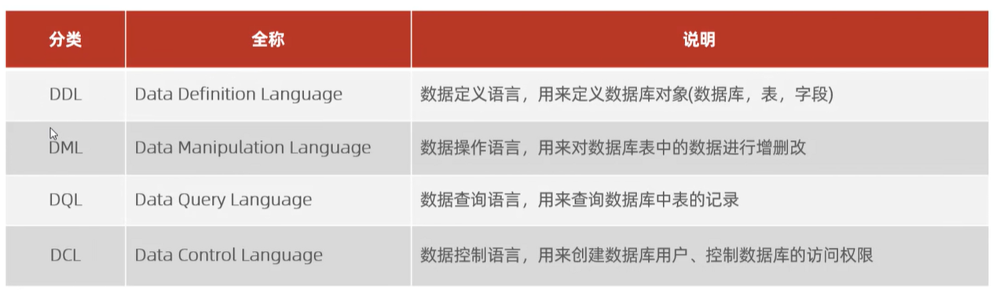

# mysql
mysql_learn

# 1.数据库相关概念

#### 数据库

- 数据存储的仓库

#### 数据库管理系统

- 操纵和管理数据库的大型软件

#### SQL

- 操作关系型数据库的编程语言 是一套标准

#### 主流的关系型数据库

- oracle
- mysql
- sqlserver
- postgresql

#### 关系型数据库

- **概念：** 建立在关系模型基础上，由多张相互连接的二维表组成的数据库

- **特点：** 
  - 1.使用表存储数据。格式统一，便于维护
  - 2.使用sql语言操作，标准统一，使用方便

#### 链接方式

- 使用自带命令行工具

  - mysql 80 command line Client

- windows自带命令行工具链接

  - 

  - ```sql
    mysql [-h ip地址] [-h 端口号] -u root -p
    # 地址与 端口号可以自动省略
    ```

  - 注意 此方法需要配置mysql 环境变量（系统变量）

# 2.SQL通用语法

- 1.sql语句可以单行或多行书写，以分号结尾
- 2.sql语句可以使用空格/缩进来增强语句的可读性
- 3.mysql数据库的sql语句不区分大小写；关键字建议使用大写
- 4.注释：
  - 单行注释：--注释内容或#注释内容（mysql特有）
  - 多行注释/*注释内容*/

# 3.sql语句分类



- ddl：数据定义语言，用来定义数据库对象（数据库，表，字段）
- dml:数据操作语言，用来对数据库中的数据进行增删改查
- dql：数据查询语言，用来查询数据库中表的记录
- dcl：数据控制语言，用来创建数据库用户、控制数据库的访问权限

# 4.DDL

#### 1.数据库操作

- 查询

  - 查询所有数据库

  - ```sql 
    SHOW DATABASES;
    ```

  - 查询所有数据库

  - ```SQL
    SELECT BATABASE();
    ```

- 创建

  - ```sql
    CREATE DATABASE [IF NOT EXISTES] 数据库名 [DEFAULT CHARSET 字符集] [COLLATE排序规则]
    ```

    -  [IF NOT EXISTES] ：如果数据库存在不做任何操作
    -  [DEFAULT CHARSET ]：指定当前数据库使用的字符集 例如 utf-8

- 删除

  - ```sql
    DROP DATABASE [IF EXISTS] 数据库名
    ```

    

- 使用

  - ```sql
    USE 数据库名
    ```

#### 2.表操作

- 查询当前数据库所有表

  - ```sql
    SHOW TABLES;
    ```

- 查询表结构

  - ```sql
    DESC 表名;
    ```

- 查询指定表的建表语句

  - ```sql
    SHOW CREATE TABLE 表名;
    ```

- 创建

  - ```sql
    CREATE TABLE 表明（
    	字段1 字段1的类型 [comment 字段1注释]，
    ）[comment 表注释]
    ```

  - 注意： 【。。。】是可选字段   最后一个字段后面没有逗号

- 数据结构

  mysql 中数据类型有很多主要分为三类 数值类型、字符串类型、日期时间类型

  <table>
    <tr>
      <th> 分类</th>
      <th> 类型</th>
      <th>大小</th>
    <th>有符号范围</th>
      <th>无符号范围</th>
      <th>描述</th>
    </tr>
    <tr>
      <td rowspan="8">数值类型</td>
      <td>Cell 1</td>
      <td>Cell 2</td>
        <td>Cell 1</td>
      <td>Cell 2</td>
        <td>Cell 1</td>  </tr>
    <tr>
         <td>Cell 1</td>
      <td>Cell 2</td>
        <td>Cell 1</td>
      <td>Cell 2</td>
        <td>Cell 1</td>  </tr>
    <tr>
          <td>Cell 1</td>
      <td>Cell 2</td>
        <td>Cell 1</td>
      <td>Cell 2</td>
        <td>Cell 1</td>  </tr>
  </table>

