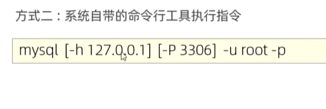

# mysql
mysql_learn

# 1.数据库相关概念

#### 数据库

- 数据存储的仓库

#### 数据库管理系统

- 操纵和管理数据库的大型软件

#### SQL

- 操作关系型数据库的编程语言 是一套标准

#### 主流的关系型数据库

- oracle
- mysql
- sqlserver
- postgresql

#### 关系型数据库

- **概念：** 建立在关系模型基础上，由多张相互连接的二维表组成的数据库

- **特点：** 
  - 1.使用表存储数据。格式统一，便于维护
  - 2.使用sql语言操作，标准统一，使用方便

#### 链接方式

- 使用自带命令行工具

  - mysql 80 command line Client

- windows自带命令行工具链接

  - 

  - ```sql
    mysql [-h ip地址] [-h 端口号] -u root -p
    # 地址与 端口号可以自动省略
    ```

  - 注意 此方法需要配置mysql 环境变量（系统变量）

# 2.SQL通用语法

- 1.sql语句可以单行或多行书写，以分号结尾
- 2.sql语句可以使用空格/缩进来增强语句的可读性
- 3.mysql数据库的sql语句不区分大小写；关键字建议使用大写
- 4.注释：
  - 单行注释：--注释内容或#注释内容（mysql特有）
  - 多行注释/*注释内容*/

# 3.sql语句分类


- ddl：数据定义语言，用来定义数据库对象（数据库，表，字段）
- dml:数据操作语言，用来对数据库中的数据进行增删改查
- dql：数据查询语言，用来查询数据库中表的记录
- dcl：数据控制语言，用来创建数据库用户、控制数据库的访问权限

# 4.DDL

#### 1.数据库操作

- 查询

  - 查询所有数据库

  - ```sql 
    SHOW DATABASES;
    ```

  - 查询所有数据库

  - ```SQL
    SELECT BATABASE();
    ```

- 创建

  - ```sql
    CREATE DATABASE [IF NOT EXISTES] 数据库名 [DEFAULT CHARSET 字符集] [COLLATE排序规则]
    ```

    -  [IF NOT EXISTES] ：如果数据库存在不做任何操作
    -  [DEFAULT CHARSET ]：指定当前数据库使用的字符集 例如 utf-8

- 删除

  - ```sql
    DROP DATABASE [IF EXISTS] 数据库名
    ```

    

- 使用

  - ```sql
    USE 数据库名
    ```

#### 2.表操作

- 查询当前数据库所有表

  - ```sql
    SHOW TABLES;
    ```

- 查询表结构

  - ```sql
    DESC 表名;
    ```

- 查询指定表的建表语句

  - ```sql
    SHOW CREATE TABLE 表名;
    ```

- 创建

  - ```sql
    CREATE TABLE 表明（
    	字段1 字段1的类型 [comment 字段1注释]，
    ）[comment 表注释]
    ```

  - 注意： 【。。。】是可选字段   最后一个字段后面没有逗号

- 修改表操作

  - 添加字段

    ```sql
    ALTER TABLE 表名 ADD 字段名 类型（长度） [COMMENT 注释][约束]
    alter table user_info add name varchar(10) comment '用户姓名'
    ```

  - 修改数据类型

    ```sql
    ALTER TABLE 表名 MODIFY 字段名 新数据类型（长度）;
    ```

  - 修改字段名和字段类型

    ```sql
    ALTER TABLE 表名 CHANGE 旧字段名 新字段名 类型（长度） [COMMENT 注释] [约束];
    ```

  - 删除字段

    ```sql
    ALTER TABLE 表名 DROP 字段名：
    
    ```
    
   - 修改表名

      ```sql
      ALTER TABLE 表名 RENAME TO 新表名：	
      ```

  - 删除表

      ```sql
      DROP TABLE [IF EXISTS] 表名；
      ```

  - 删除指定表，并重新创建该表

      ```sql
      TRUNCATE TABLE 表名：  删除表表中的数据也会被删除
      ```

      

#### 3.数据结构


  mysql 中数据类型有很多主要分为三类 数值类型、字符串类型、日期时间类型

  <table>
    <tr>
      <th> 分类</th>
      <th> 类型</th>
      <th>大小</th>
    <th>有符号范围(SIGNED)</th>
      <th>无符号范围(UNSIGNED)</th>
      <th>描述</th>
    </tr>
    <tr>
      <td rowspan="8">数值类型</td>
      <td>TINYINT</td>
      <td>1bytes</td>
      <td>(-128,127)</td>
      <td>(0,255)</td>
        <td>小整数值</td>  </tr>
    <tr>
         <td>SMALLINT</td>
      <td>2bytes</td>
        <td>(-32768,32767)</td>
      <td>(0,65535)</td>
        <td>大整数值</td>  </tr>
    <tr>
          <td>MEDIUMINT</td>
      <td>3bytes</td>
      <td>(-8388608,8388607)</td>
        <td>(0,16777215)</td>
        <td>大整数值</td>  </tr>
        <tr>
          <td>INT或INTEGER</td>
      <td>4bytes</td>
      <td>(-2147483648,2147483647)</td>
        <td>(0,4294967295)</td>
        <td>大整数值</td>  </tr>
       <tr>
          <td>BIGINT</td>
      <td>8bytes</td>
      <td>(-2^63,2^63-1)</td>
        <td>(0,2^64-1)</td>
        <td>极大大整数值</td>  </tr>
           <tr>
          <td>FLOAT</td>
      <td>4bytes</td>
      <td>(-3.402823466E+38,3.402823466351 E+38)</td>
        <td>0和（1.175494351 E-38 ，3.402823466 E+38）</td>
        <td>单精度浮点数值</td>  </tr>
           <tr>
          <td>DOUBLE</td>
      <td>8bytes</td>
      <td>（-1.7976931348623157 E308 ，1.7976931348623157 E308）</td>
        <td>0和（2.2250738585072014 E-308 ，1.7976931348623157 E+308）</td>
        <td>双精度浮点数值</td>  </tr>
        <tr>
          <td>DECIMAL</td>
      <td></td>
      <td>依赖于M（精度）和D（标度）的值</td>
        <td>依赖于M（精度）和D（标度）的值</td>
        <td>小数值（精确定点数）</td>  </tr>
  </table>

**精度 为数字整体长度 标度为小数点后的 长度**

<table>
  <tr>
    <th> 分类</th>
    <th> 类型</th>
    <th>大小</th>
    <th>描述</th>
  </tr>
  <tr>
    <td rowspan="10">字符串类型</td>
    <td>CHAR</td>
    <td>0-255bytes</td>
      <td>定长字符串</td>  </tr>
  <tr>
       <td>VARCHAT</td>
    <td>0-65535bytes</td>
      <td>变长字符串</td>  </tr>
  <tr>
        <td>TINYBLOB</td>
    <td>0-255bytes</td>
      <td>不超过255个字符的二进制数据</td>  </tr>
      <tr>
        <td>TINYTEXT</td>
    <td>0-255bytes</td>
      <td>短文本字符串</td>  </tr>
     <tr>
        <td>BLOB</td>
     <td>0-65 535bytes</td>
      <td>二进制形式长文本数据</td>  </tr>
         <tr>
        <td>TEXT</td>
  <td>0-65 535bytes</td>
      <td>长文本数据</td>  </tr>
         <tr>
        <td>MEDIUMBLOB</td>
    <td>0-16 777 215bytes</td>
      <td>二进制形式的中等长文本数据</td>  </tr>
      <tr>
        <td>MEDIUMTEXT</td>
    <td>0-16 777 215bytes</td>
      <td>中等长文本数据</td>  </tr>
        <tr>
        <td>LONGBLOB</td>
    <td>0-4 294 967 295 bytes</td>
      <td>二进制形式的极大文本数据</td>  </tr>
      <tr>
        <td>LONGTEXT</td>
    <td>0-4 294 967 295 bytes</td>
      <td>极大文本数据</td>  </tr>
</table>

<table>
  <tr>
    <th> 分类</th>
    <th> 类型</th>
    <th>大小</th>
    <th>范围</th>
    <th>格式</th>
    <th>描述</th>
  </tr>
  <tr>
    <td rowspan="5">日期类型</td>
    <td>DATE</td>
    <td>3</td>
     <td>1000-01-01至9999-12-31</td>  
     <td>yyyy-mm-dd</td>  
     <td>日期值</td>  
    </tr>
  <tr>
      <td>TIME</td>
    <td>3</td>
      <td>-838：59：59 至838-59-59</td>  
    <td>hh:mm:ss</td>
    <td>时间值或持续时间</td>
      </tr>
<tr>
        <td>YEAR</td>
    <td>1</td>
      <td>1901至2155</td> 
    <td>yyyy</td>
    <td>年份值</td>
    </tr>
      <tr>
        <td>DATETIME</td>
        <td>8</td>
    <td>1000-01-01 00：00：00 至9999-12-31 23：59：59</td>
        <td>yyyy:mm:dd hh:mm:ss</td>
      <td>混合日期时间值</td>  
    </tr>
     <tr>
        <td>TIMESTAMP</td>
     <td>4</td>
      <td>1970-01-01 00：00：00 至2038-1-19 3：14：07</td>  
        <td>yyyy:mm:dd hh:mm:ss</td>
      <td>混合日期时间值、时间戳</td>  
    </tr>
</table>

​      

# 5.DML

对数据库中表的数据记录进行增删改的操作  

#### 1.增加数据

1.给指定字段添加数据

```sql
INSERT INTO 表名 （字段名1，字段名2） VALUES （值1，值2）
insert into user(id,gender,nickname) values(1,'1','jake');
```

2.给全部字段添加数据

```sql
INSERT INTO 表名 VALUES （值1，值2....）
 insert into user values(2,'1','tom');
```

3.批量添加数据

```sql
INSERT INTO 表名 （字段名1，字段名2） VALUES （值1，值2）,（值1，值2）,（值1，值2）
insert into user(id,gender,nickname) values(1,'1','jake')，(2,'0','jerry');

INSERT INTO 表名 VALUES （值1，值2....）,（值1，值2....）,（值1，值2....）,

```

注意：

- 插入数据时，指定的阻断顺序需要与值的顺序是一一对应的
- 字符串和日期型数据应该包含在引号中
- 插入的数据大小，应该在字段的规定范围内

#### 2.修改数据

 DML修改数据

```sql
UPDATE 表名 SET 字段名1 = 值1，字段名2= 值2，。。。[where 条件]；
UPDATE user  set nickname = 'SQ' WHERE id = 1;
UPDATE user  set nickname = 'SQ'，gender = ‘1’ WHERE id = 1;
UPDATE user  set nickname = 'SQ'
```

注意：

- 修改语句的条件可以有也可以没有，如果没有条件那么则会修改整张表的数据

#### 3.删除所有数据

DML删除数据

```sql
DELETE FROM 表名 [where 条件]；
DELETE FROM `user` where gender = 2;

```

注意

- where 可有可无 没有就会删除整张表的数据
- delete 语句不能删除某个字段的名字可以使用update